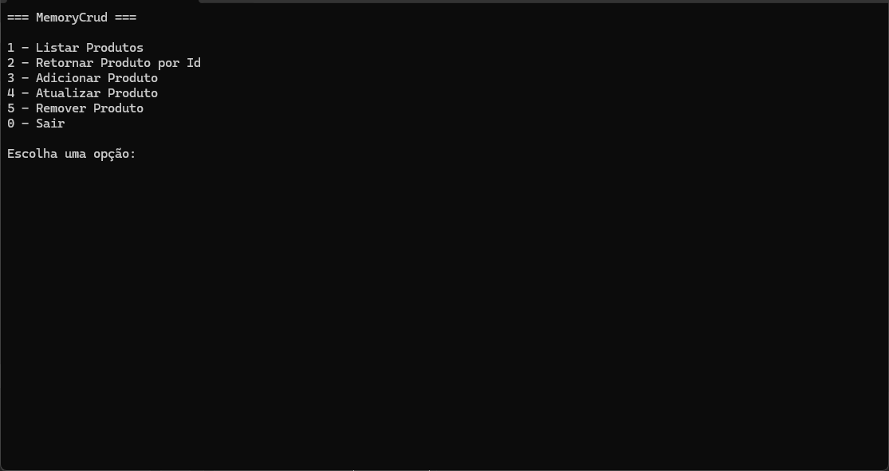

# Memory Crud

Memory Crud é um sistema que implementa um CRUD (Create, Read, Update, Delete) em C# e .NET com o intuito de consolidar meu aprendizado em conceitos de POO, código reutilizável, manipulação de interfaces, classes e métodos genéricos.

## Sobre o projeto
O Projeto foi feito durante meus estudos sobre o ecossistema .NET e a linguagem C#, onde meu objetivo foi criar uma base sólida de conceitos intermediários e treinar a lógica em uma linguagem totalmente nova.

## Conceitos Aplicados
Durante o desenvolvimento, foram aplicados os seguintes conceitos:
- **Herança:** Implementei uma classe abstrata para representar entidades genéricas.
- **Interfaces:** A utilização de interfaces juntamente com constraints, foi essencial para a padronização e reutilização de métodos.
- **Generics & Constraints:** Durante o desenvolvimento, foi desenvolvido interfaces e classes genéricas que garantem a reusabilidade de código para a manipulação de novas entidades em diferentes repositórios.
- **Injeção de Dependência:** O conceito de inversão de controle via argumento é um ponto chave para a flexibilidade e baixo acoplamento do código.

## Observações Pessoais
Como desenvolvedor Python, senti uma curva de aprendizado maior porém muito gratificante. As características da linguagem C# e sua forte tipagem, permitiram criar arquiteturas extremamente organizada.

Além das características, senti uma certa semelhança durante o desenvolvimento, consegui reutilizar conceitos de POO que foi aprendido e consolidado na linguagem Python e vejo que, ambas as linguagens podem ser extremamente poderosas em futuros projetos com implementação de ambas.

## Tecnologias Utilizadas
- C# 12
- .NET 8/9

## Como Executar
### 1. Clone o repositório
```bash
git clone https://github.com/AfonsoDolmen/csharp-memorycrud.git
```

### 2. Entre na pasta do projeto
```bash
cd MemoryCrud
```

### 3. Rode o projeto
```bash
dotnet run
```